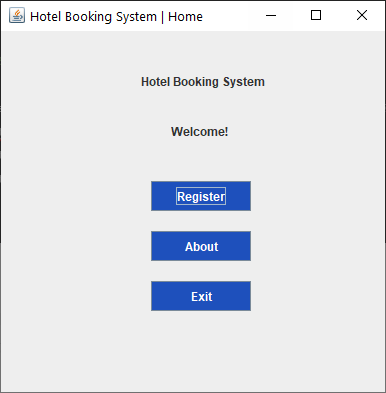
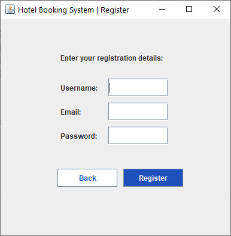
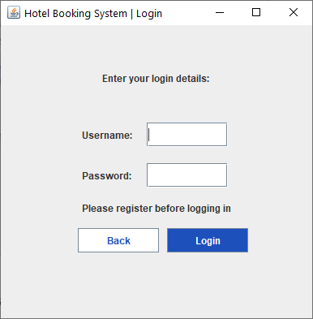
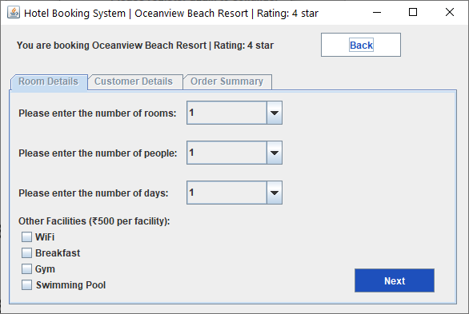
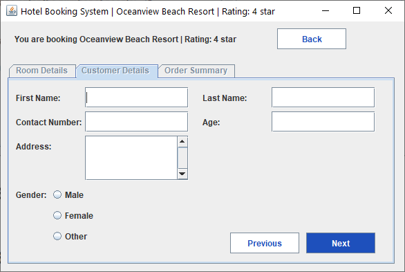
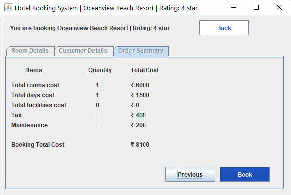

# Hotel Booking System

This project was part of the 4th semester Computer Science & Engineering mini project of the subject 'Object Oriented Concepts'.

## Usage

Open the folder `HotelBookingSystem` with NetBeans, and click on the run project.

## Problem Statement

Overcomplication is one of the major problems faced by customers while looking for a hotel as per their needs. Hotel Booking System is designed to simplify this process for its customers by providing all deals upfront to them in an easy and simple way, while providing a user-friendly UI, to navigate through the application with ease.

## Technologies used

Java,
Java Swing 

## Output

### Home Frame:

  

### Register Frame:

 

### Login Frame:

 

### Booking Frame:

 

### Booking Details Frame:
#### Room Details Tab:

 

#### Customer Details Tab:

 

#### Order Summary Tab:

 
